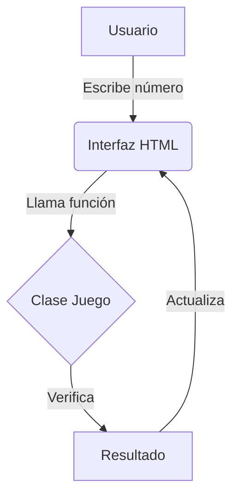
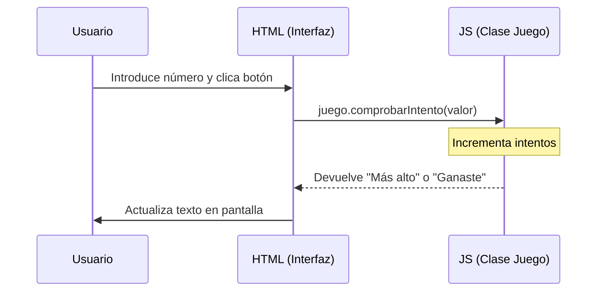

# Arquitectura del Juego

```mermaid
graph TD
    A[Usuario] -->|Escribe número| B(Interfaz HTML)
    B -->|Llama función| C{Clase Juego}
    C -->|Verifica| D[Resultado]
    D -->|Actualiza| B
```

# Diagrama de secuencia

```mermaid
sequenceDiagram
    participant U as Usuario
    participant H as HTML (Interfaz)
    participant J as JS (Clase Juego)

    U->>H: Introduce número y clica botón
    H->>J: juego.comprobarIntento(valor)
    Note over J: Incrementa intentos
    J-->>H: Devuelve "Más alto" o "Ganaste"
    H->>U: Actualiza texto en pantalla
```
