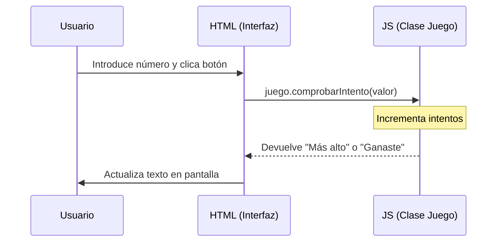

```mermaid
sequenceDiagram
    participant U as Usuario
    participant H as HTML (Interfaz)
    participant J as JS (Clase Juego)

    U->>H: Introduce número y clica botón
    H->>J: juego.comprobarIntento(valor)
    Note over J: Incrementa intentos
    J-->>H: Devuelve "Más alto" o "Ganaste"
    H->>U: Actualiza texto en pantalla
```
