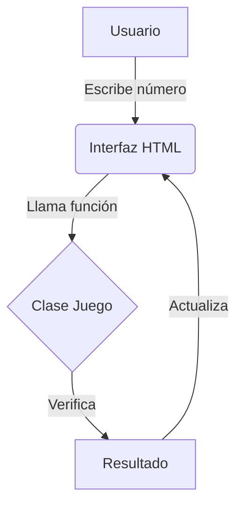
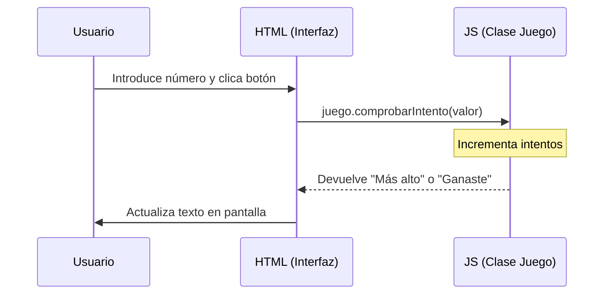
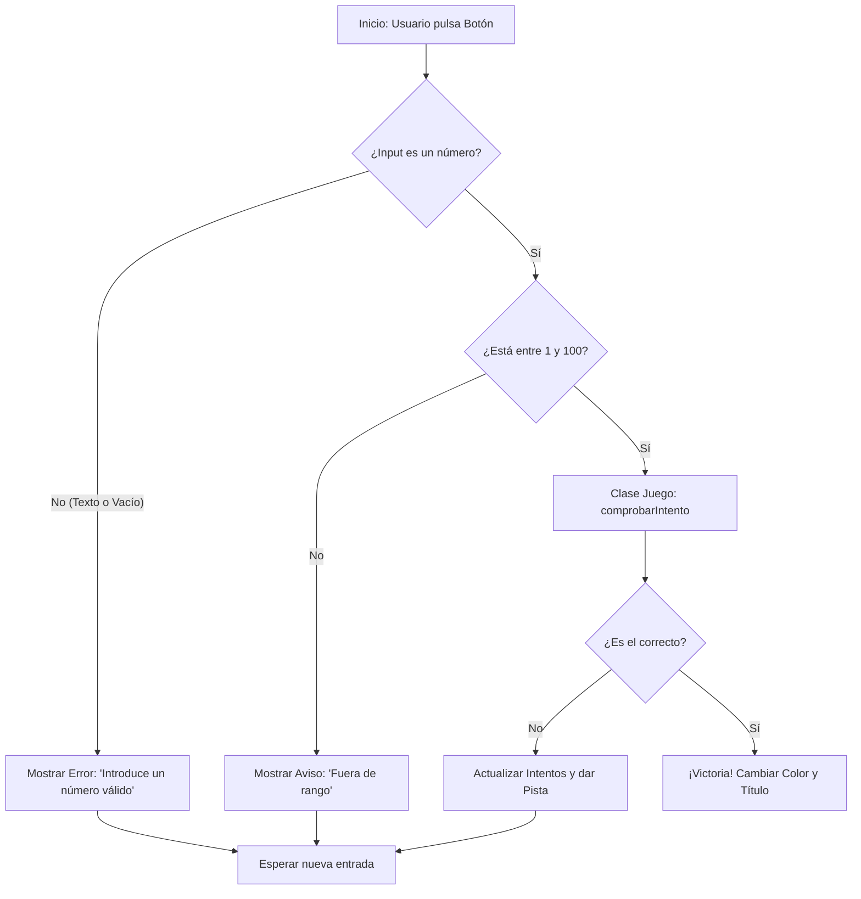
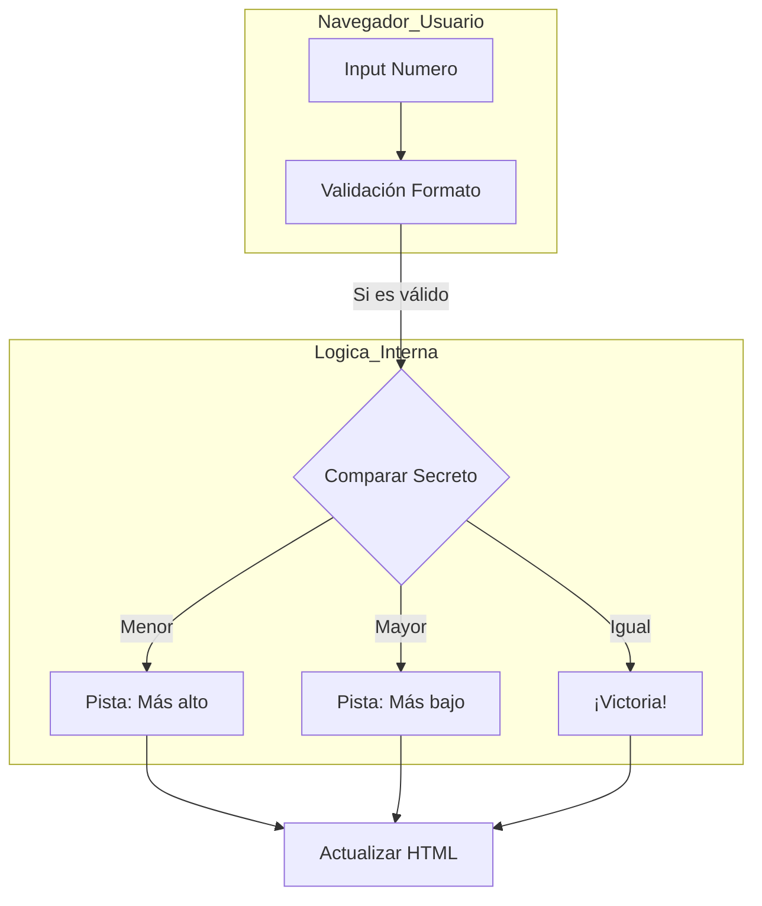

# Arquitectura del Juego

```mermaid
graph TD
    A[Usuario] -->|Escribe número| B(Interfaz HTML)
    B -->|Llama función| C{Clase Juego}
    C -->|Verifica| D[Resultado]
    D -->|Actualiza| B
```

# Diagrama de secuencia

```mermaid
sequenceDiagram
    participant U as Usuario
    participant H as HTML (Interfaz)
    participant J as JS (Clase Juego)

    U->>H: Introduce número y clica botón
    H->>J: juego.comprobarIntento(valor)
    Note over J: Incrementa intentos
    J-->>H: Devuelve "Más alto" o "Ganaste"
    H->>U: Actualiza texto en pantalla
```
# Validación de errores

```mermaid
graph TD
    A[Inicio: Usuario pulsa Botón] --> B{¿Input es un número?}
    B -- No (Texto o Vacío) --> C[Mostrar Error: 'Introduce un número válido']
    B -- Sí --> D{¿Está entre 1 y 100?}
    D -- No --> E[Mostrar Aviso: 'Fuera de rango']
    D -- Sí --> F[Clase Juego: comprobarIntento]
    F --> G{¿Es el correcto?}
    G -- No --> H[Actualizar Intentos y dar Pista]
    G -- Sí --> I[¡Victoria! Cambiar Color y Título]
    H --> J[Esperar nueva entrada]
    C --> J
    E --> J
```

# Subgrafos

```mermaid
graph TB
    subgraph Navegador_Usuario
        A[Input Numero] --> B[Validación Formato]
    end
    
    subgraph Logica_Interna
        B -- "Si es válido" --> C{Comparar Secreto}
        C -- "Menor" --> D[Pista: Más alto]
        C -- "Mayor" --> E[Pista: Más bajo]
        C -- "Igual" --> F[¡Victoria!]
    end

    D --> G[Actualizar HTML]
    E --> G
    F --> G
```
