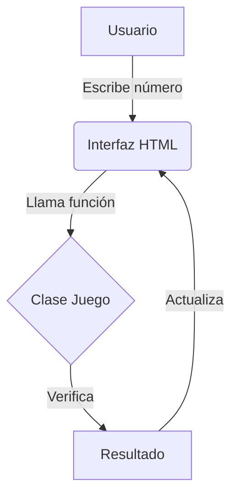
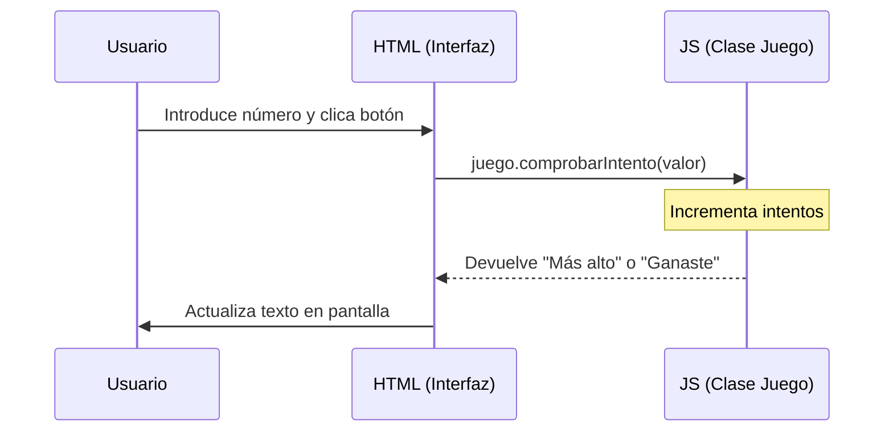
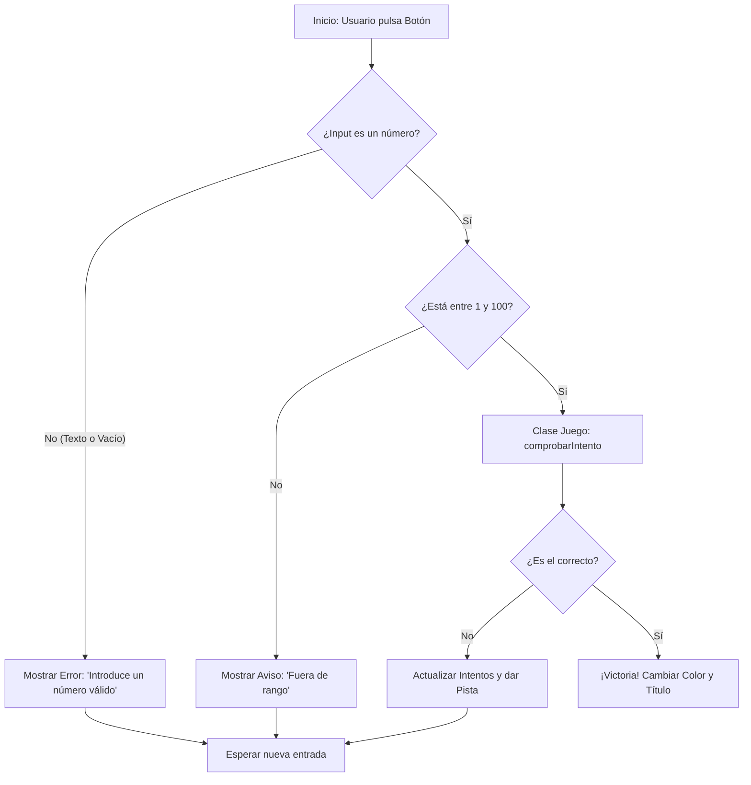
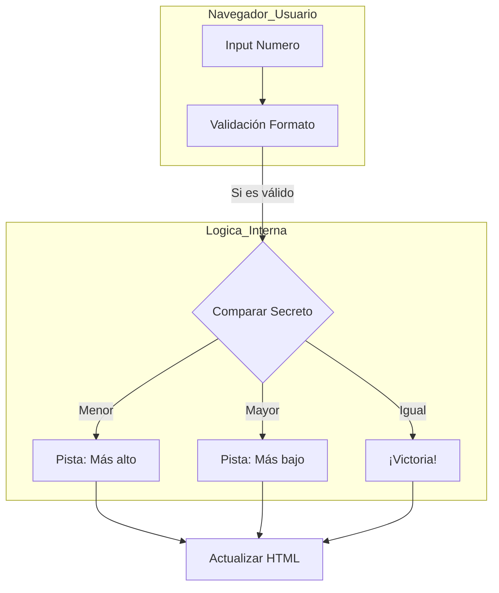

# Tipos de diagramas:
1. Diagrama de Clases (UML de Estructura)
Este diagrama define la arquitectura de tu código siguiendo el modelo de Orientación a Objetos (como en Java).
Clase JuegoAdivinanza: Contiene los atributos internos (numeroSecreto, intentos) y la lógica pura (comprobarIntento).
Clase Interfaz/DOM: Maneja lo que el usuario ve (el input, el botón y los mensajes en pantalla).
Objetivo: Separar la "inteligencia" del juego de los "botones" de la web.

2. Diagrama de Secuencia (UML de Comportamiento)
Representa el paso a paso cronológico desde que ocurre una acción hasta que se recibe una respuesta.
Flujo: Usuario → Clic en Botón → Validación en JS → Consulta a la Clase Juego → Respuesta al HTML → Actualización del <title> de la página.
Objetivo: Visualizar cómo "viaja" la información entre los distintos archivos y funciones.

3. Diagrama de Flujo / Bloques (Lógica con Validaciones)
Es el que has incluido en tu README.md usando Mermaid.js.
Nodos de Decisión: Incluye los rombos de control (¿Es un número válido?, ¿Está en el rango 1-100?, ¿Es el número correcto?).
Caminos de Error: Define qué mensajes mostrar si el usuario se equivoca al escribir (texto en lugar de números).
Objetivo: Servir como mapa lógico para programar todas las posibilidades (casos de éxito y casos de error).

# Arquitectura del Juego

# Diagrama de secuencia

# Validación de errores

# Subgrafos

