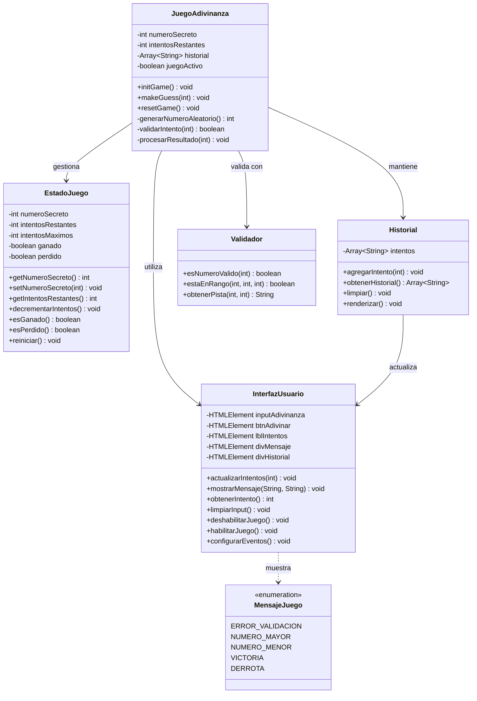

```mermaid
classDiagram
    class JuegoAdivinanza {
        -int numeroSecreto
        -int intentosRestantes
        -Array~String~ historial
        -boolean juegoActivo
        +initGame() void
        +makeGuess(int) void
        +resetGame() void
        -generarNumeroAleatorio() int
        -validarIntento(int) boolean
        -procesarResultado(int) void
    }

    class EstadoJuego {
        -int numeroSecreto
        -int intentosRestantes
        -int intentosMaximos
        -boolean ganado
        -boolean perdido
        +getNumeroSecreto() int
        +setNumeroSecreto(int) void
        +getIntentosRestantes() int
        +decrementarIntentos() void
        +esGanado() boolean
        +esPerdido() boolean
        +reiniciar() void
    }

    class InterfazUsuario {
        -HTMLElement inputAdivinanza
        -HTMLElement btnAdivinar
        -HTMLElement lblIntentos
        -HTMLElement divMensaje
        -HTMLElement divHistorial
        +actualizarIntentos(int) void
        +mostrarMensaje(String, String) void
        +obtenerIntento() int
        +limpiarInput() void
        +deshabilitarJuego() void
        +habilitarJuego() void
        +configurarEventos() void
    }

    class Historial {
        -Array~String~ intentos
        +agregarIntento(int) void
        +obtenerHistorial() Array~String~
        +limpiar() void
        +renderizar() void
    }

    class Validador {
        +esNumeroValido(int) boolean
        +estaEnRango(int, int, int) boolean
        +obtenerPista(int, int) String
    }

    class MensajeJuego {
        <<enumeration>>
        ERROR_VALIDACION
        NUMERO_MAYOR
        NUMERO_MENOR
        VICTORIA
        DERROTA
    }

    JuegoAdivinanza --> EstadoJuego : gestiona
    JuegoAdivinanza --> InterfazUsuario : utiliza
    JuegoAdivinanza --> Historial : mantiene
    JuegoAdivinanza --> Validador : valida con
    InterfazUsuario ..> MensajeJuego : muestra
    Historial --> InterfazUsuario : actualiza
```
