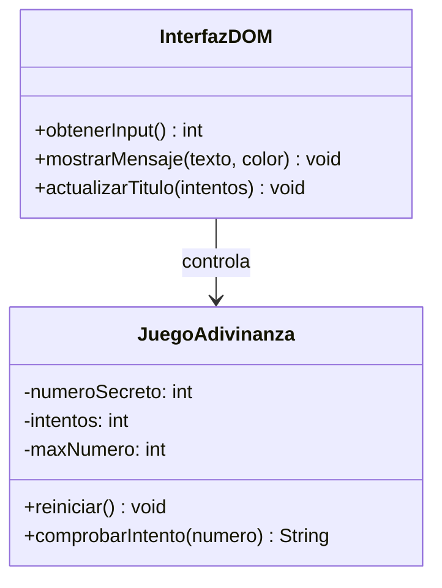
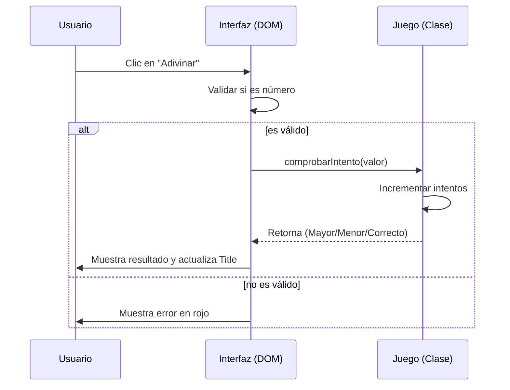
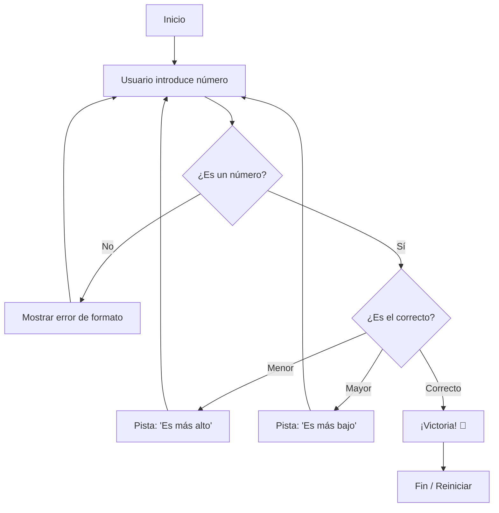

# Prompt completo para Generación de Diagramas:
"Genera el código Mermaid.js para tres diagramas distintos basados en un juego web de 'Adivina el Número'. El sistema consiste en una clase 'Juego' (lógica), una clase 'Interfaz' (DOM) y el Usuario.
Diagrama de Clases (UML): Debe mostrar la clase Juego con atributos privados (numeroSecreto, intentos) y métodos (comprobarIntento, reiniciar). La clase Interfaz debe tener métodos para capturar el input y actualizar el mensaje en pantalla.
Diagrama de Secuencia: Debe mostrar el flujo desde que el Usuario pulsa el botón, la Interfaz valida que sea un número, el objeto Juego procesa el intento e incrementa el contador, y finalmente la Interfaz actualiza el DOM y el document.title.
Diagrama de Bloques (Flowchart): Debe representar la lógica de decisión: Inicio -> Entrada de datos -> ¿Es número válido? -> ¿Es igual, mayor o menor? -> Actualizar pantalla -> ¿Fin del juego o continuar?
Por favor, utiliza estilos visuales limpios y asegúrate de que cada diagrama esté en un bloque de código separado."

## Diagrama de clases

## Diagrama de secuencia

  ## Diagrama de bloques

