# Prompt completo para Generación de Diagramas:
"Genera el código Mermaid.js para tres diagramas distintos basados en un juego web de 'Adivina el Número'. El sistema consiste en una clase 'Juego' (lógica), una clase 'Interfaz' (DOM) y el Usuario.
Diagrama de Clases (UML): Debe mostrar la clase Juego con atributos privados (numeroSecreto, intentos) y métodos (comprobarIntento, reiniciar). La clase Interfaz debe tener métodos para capturar el input y actualizar el mensaje en pantalla.
Diagrama de Secuencia: Debe mostrar el flujo desde que el Usuario pulsa el botón, la Interfaz valida que sea un número, el objeto Juego procesa el intento e incrementa el contador, y finalmente la Interfaz actualiza el DOM y el document.title.
Diagrama de Bloques (Flowchart): Debe representar la lógica de decisión: Inicio -> Entrada de datos -> ¿Es número válido? -> ¿Es igual, mayor o menor? -> Actualizar pantalla -> ¿Fin del juego o continuar?
Por favor, utiliza estilos visuales limpios y asegúrate de que cada diagrama esté en un bloque de código separado."

## Diagrama de clases

## Diagrama de secuencia

```mermaid
    sequenceDiagram
    participant U as Usuario
    participant I as Interfaz (DOM)
    participant J as Juego (Clase)

    U->>I: Clic en "Adivinar"
    I->>I: Validar si es número
    alt es válido
        I->>J: comprobarIntento(valor)
        J->>J: Incrementar intentos
        J-->>I: Retorna (Mayor/Menor/Correcto)
        I->>U: Muestra resultado y actualiza Title
    else no es válido
        I->>U: Muestra error en rojo
    end
```

  ## Diagrama de bloques

```mermaid
    graph TD
    A[Inicio] --> B[Usuario introduce número]
    B --> C{¿Es un número?}
    C -- No --> D[Mostrar error de formato]
    D --> B
    C -- Sí --> E{¿Es el correcto?}
    E -- Menor --> F[Pista: 'Es más alto']
    E -- Mayor --> G[Pista: 'Es más bajo']
    E -- Correcto --> H[¡Victoria! 🎉]
    F --> B
    G --> B
    H --> I[Fin / Reiniciar]
```

